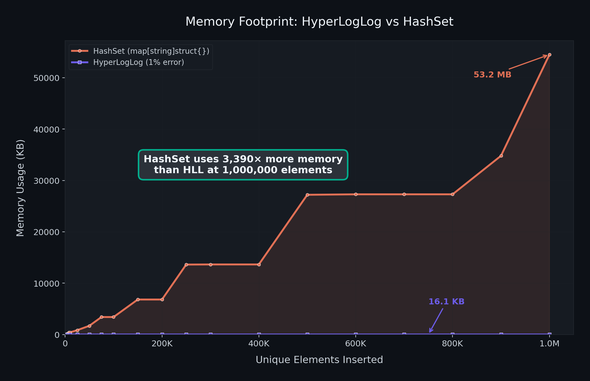
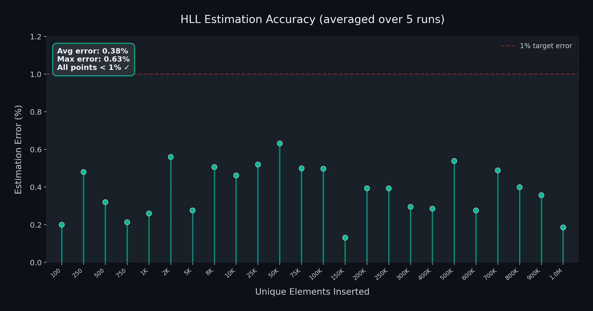

# Prism 🔮

A simple demonstration of how **HyperLogLog** can count unique visitors across your API without storing a single IP address.

This project was built alongside a blog post exploring probabilistic data structures. It's a hands-on way to see the theory in action.

---

## What Problem Does This Solve?

Imagine you run an API with thousands of endpoints. You want to know how many *unique* visitors each endpoint gets.

The straightforward approach is to store every IP in a `map[string]struct{}`. That works, until you have a million unique visitors. At that point, you're burning **53 MB of RAM** just to answer "how many?"

Now imagine you have hundreds of routes. That map-per-route approach doesn't scale.

---

## The Idea

What if we could count unique visitors without storing them at all?

That's exactly what a **HyperLogLog** does. It's a probabilistic data structure that answers the question "approximately how many unique elements have I seen?" using a fixed amount of memory — regardless of how many elements you throw at it.

The trade-off is a small estimation error (configurable — we use 1%). In exchange:

- **16 KB** of memory instead of 53 MB. That's **3,390× smaller**.
- Accuracy stays within 1% of the true count, averaged over multiple runs.
- Memory stays flat. One visitor or one million — same 16 KB.

---

## How Prism Works

1. Every incoming HTTP request passes through a tracking middleware.
2. The middleware extracts the visitor's IP (from `X-Forwarded-For`, `X-Real-IP`, or `RemoteAddr`).
3. The IP is hashed with xxHash and fed into a per-route HyperLogLog instance.
4. When you query `/internal/stats?target=/api/v1/products/list`, the HLL returns the estimated unique count.

```go
// Middleware — one line to plug into any route
mux.Handle("/api/v1/products/list", analytics.TrackingMiddleware(tr, productsHandler))

// Query the estimate
GET /internal/stats?target=/api/v1/products/list
→ Total Unique Visitors for /api/v1/products/list: 247,832
```

No IP is stored. No map grows. The count comes from the register state of the HLL.

---

## Results

We ran a memory benchmark comparing HyperLogLog against a standard `map[string]struct{}`, inserting up to 1 million unique elements. All numbers are averaged over 5 independent runs with different hash seeds.



| Unique Elements | HLL | HashSet | Ratio |
|-----------------|-----|---------|-------|
| 1,000 | 5.3 KB | 53.3 KB | 10× |
| 10,000 | 16.1 KB | 426.6 KB | 27× |
| 100,000 | 16.1 KB | 3.3 MB | 212× |
| 1,000,000 | 16.1 KB | 53.2 MB | 3,390× |

The HLL flatlines at **16 KB** once it transitions from sparse to dense mode. The HashSet grows linearly and never stops.

### Accuracy

The HLL is configured for 1% target error. Across all 24 checkpoints, averaged over 5 runs:



| Metric | Value |
|--------|-------|
| Average error | 0.38% |
| Maximum error | 0.63% |
| Points exceeding 1% | 0 out of 24 |

---

## Getting Started

### Build

```bash
go build -o server cmd/server/main.go
go build -o loadgen cmd/loadgen/main.go
```

### Run the Server

```bash
./server
```

Or with benchmarking mode, which enables a parallel HashSet for accuracy comparison:

```bash
./server -benchmark
```

```
Server running on :8080 with benchmarking
```

### Run the Load Generator

```bash
./loadgen
```

This launches `GOMAXPROCS * 20` concurrent workers that fire 500,000 HTTP requests with spoofed IPs. 80% of traffic targets the products endpoint, 20% targets checkout.

After the run, it automatically queries the stats endpoint to print the HLL estimate vs exact count (if benchmarking is enabled).

### Run the Memory Benchmark

```bash
cd cmd/membench && go run .
```

This runs 5 iterations with different random seeds, measures heap memory at 24 checkpoints, and outputs averaged CSVs. Then generate charts:

```bash
python3 visualize.py
```

---

## A Note on Sparse-to-Dense Transition

A HyperLogLog with 1% error needs `m = 16,384` registers (2^14). Allocating all of them upfront wastes memory when the cardinality is low.

Prism's HLL starts in **sparse mode** — storing only the registers that have been touched, as packed `uint32` values:

```
[24 bits: register index | 8 bits: rho value]
```

This is efficient when few registers are populated. But each sparse entry is 4 bytes (`uint32`) compared to 1 byte (`uint8`) in dense mode. So when the sparse list grows to `m/4` entries, it takes the same memory as the full dense array.

At that crossover point, the HLL converts to dense mode — allocating a `[]uint8` of size `m` and writing all sparse entries into it. After conversion, the sparse slice is freed.

```go
// Trigger: when sparse size reaches the break-even point
if uint32(len(hll.sparse)) >= hll.m / 4 {
    hll.convertToDense()
}
```

This is why the memory chart shows HLL growing from ~600 bytes to ~16 KB, then staying flat forever.

---

## Project Layout

```
prism/
├── cmd/
│   ├── server/main.go      # HTTP server with analytics middleware
│   ├── loadgen/main.go      # Concurrent load generator (producer-consumer pattern)
│   └── membench/            # Memory benchmark + Python visualizer
├── internal/
│   ├── analytics/           # HTTP middleware — extracts IP, feeds to tracker
│   ├── hll/                 # HyperLogLog implementation (sparse + dense)
│   ├── hashset/             # Simple map[string]struct{} wrapper for benchmarking
│   └── tracker/             # Per-route HLL registry with per-entry locking
├── imgs/                    # Benchmark charts
└── README.md
```

### The HyperLogLog (`internal/hll`)

- Uses **xxHash** (`github.com/cespare/xxhash`) for fast 64-bit non-cryptographic hashing.
- Precision is derived from the target error rate: `m = (1.04 / e)²`, then rounded up to the next power of 2.
- For 1% error, this gives `k = 14` precision bits and `m = 16,384` registers.
- Estimation uses **LogLog-Beta** with a polynomial bias correction, which provides a single unified formula covering both low and high cardinality ranges without needing separate correction routines.
- For very low cardinalities (< 2.5m), falls back to **Linear Counting** using the number of empty registers.

### The Tracker (`internal/tracker`)

- Maintains a `map[string]*entry` — one HLL per route.
- Uses a two-level locking strategy: an `RWMutex` on the map for route lookup, and a separate `RWMutex` per route entry for concurrent IP tracking.
- This means tracking visitors on `/products` doesn't block tracking on `/checkout`.

### The Load Generator (`cmd/loadgen`)

- Uses a producer-consumer pattern with a buffered channel.
- Creates `GOMAXPROCS * 20` workers (I/O-bound work, so many more goroutines than CPU cores).
- Shares a single `http.Client` with `MaxIdleConnsPerHost` set to the worker count, so every worker reuses its TCP connection.

---

## Learn More

This project accompanies a blog post that goes deeper into HyperLogLog theory, the math behind the harmonic mean estimator, sparse-to-dense transitions, and why probabilistic counting is the right tool for analytics at scale.
